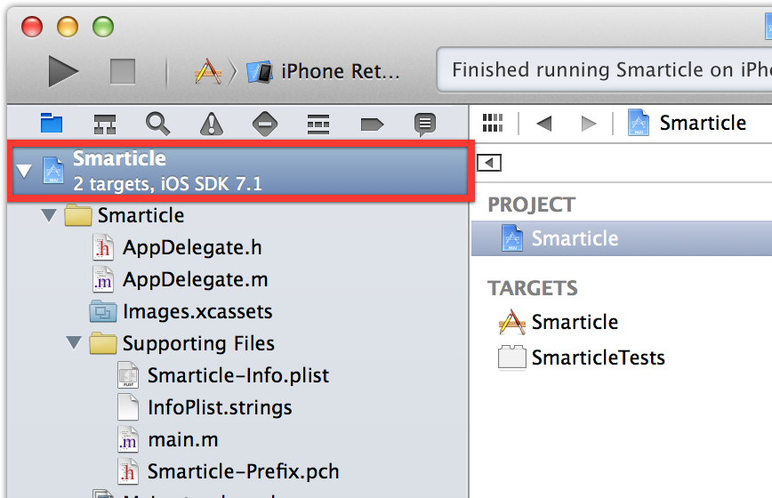
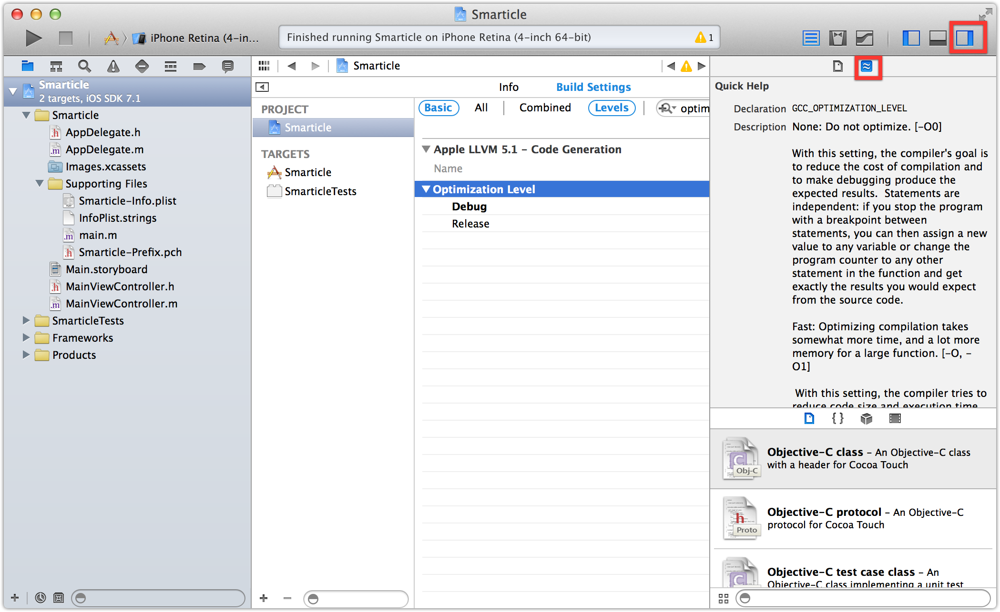
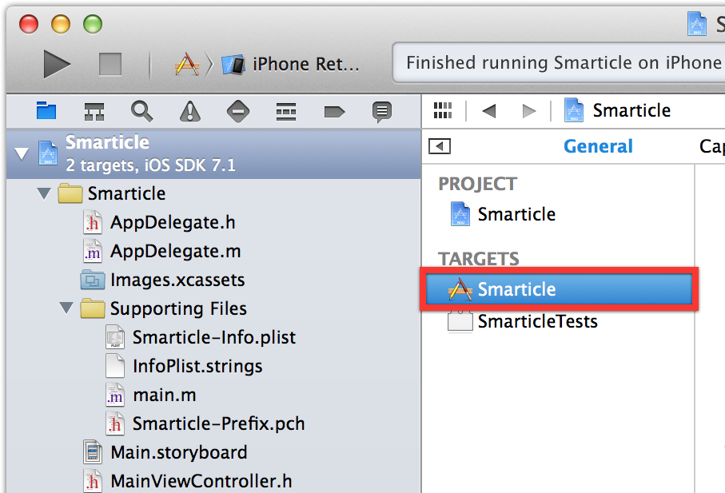
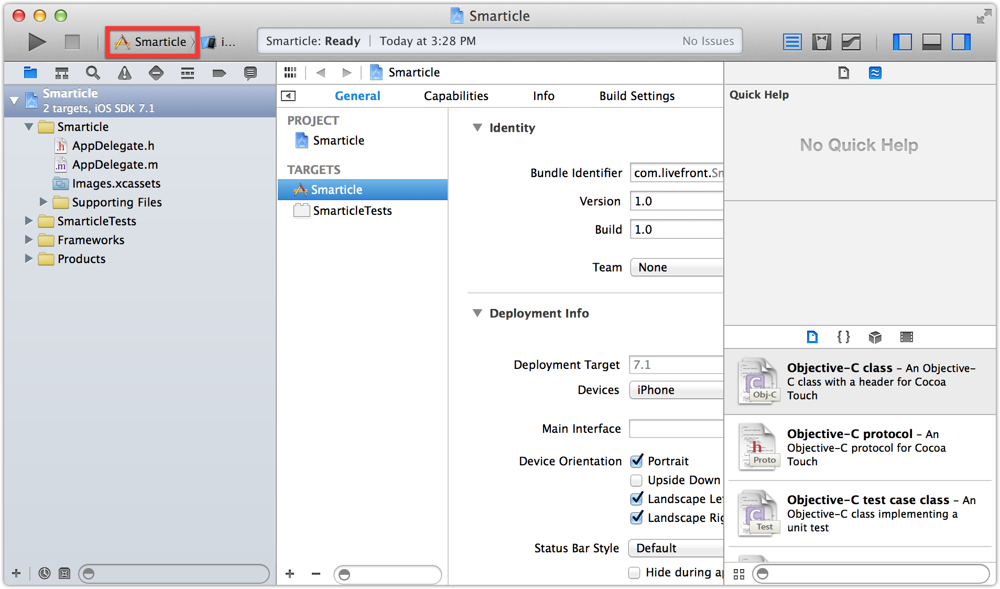
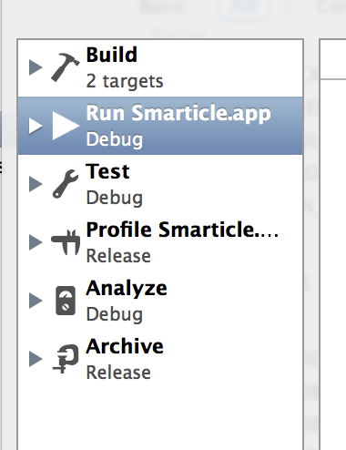

# Lab 2.1 #

This week we'll be creating a project in Xcode for our app, Smarticle.

## Objectives ##

- Create a new project for Smarticle.
- Become comfortable with adjusting build settings.
- Get acquianted with Projects, Targets and Schemes.

## Suggested Resources ##

- [Build Setting Reference](https://developer.apple.com/library/ios/documentation/DeveloperTools/Reference/XcodeBuildSettingRef/0-Introduction/introduction.html)
- [Scheme Configuration Help](https://developer.apple.com/library/ios/recipes/xcode_help-scheme_editor/_index.html)

## Create a project ##

1.  Open Xcode
2.  File > New > Project...
3.  Under iOS, select Application
4.  Select Empty Application
5.	Fill in these options for the new project
	a. Product Name: Smarticle	
	b. Organization Name: Smart Factory
	c. Company identifier:  com.smartfactory
	d. Class Prefix:  Leave blank for now
	e. Devices: iPhone
	f. Leave Core Data unchecked
6. Hit next
7. Choose a folder where you would like your new project to be saved.

Congratulations, you have a brand new project!  Let's take a moment to inspect its contents.

Click the little folder icon in the top left-hand panel.  This is the Project Navigator and shows you all the files included in the project.  Click the project itself.

This file serves as both a container for all the files and resources in your project as well as a default configuration file for all the products you could potentially build from this project.  In the filesystem, you will notice it has the extension .xcodeproj, though you shouldn't edit this file outside of Xcode.

In the main editor window, with the project selected, you should see a pane that lets you access all the various configuration options for your project.

## Build Settings ##

Build settings control how your app behaves when it is compiled and deployed.  There are a plethora of configuration options available, many which you will rarely modify.

1.  With the Project selected, click the "Build Settings" tab at the top of the main editor window.
2.  Configuration galore!  Toggle the "Basic/All" and the "Combined/Levels" buttons at the top and note what happens.  (Don't worry, this doesn't actually change any settings).
3.  Click into the search box at the top right of this panel and type the word "optimization".   The list will filter down nicely to just a few settings.
4.  Notice how this particular setting actually varies depending on the configuration (*None* for Debug builds and *Fastest,Smallest* for Release).  This is one of those settings you will probably never change, but click on the dropdown for Debug to see what you could change it to if you felt like it. Hmm, *Fast*, *Faster*, or *Fastest*, tough call.
5.  Click on Optimization Level so its highlighted and open the right hand panel.  Now click the tiny quick help icon. (It's the one with an approximately equal symbol on it.)

You should see a pretty decent description of exactly what each of the different options for optimization level do.  Another, even quicker way to see this same information is to hold the Option key and double-click the setting's name.  Give it a try.

## Targets ##

Now, in the editor window with the project selected, you will see a subnavigation panel that lists the targets in the project.  Click on the Smarticle target so it looks like this:

Notice how the main panel changed to show a different set of tabs at the top.  Take a brief tour of each one.  Don't worry too much about knowing exactly what each tab does at this point, but it's definitely worth taking a peek so you're aware of what's available.

Two important notes about targets:

- Targets allow you to build different app bundles from the same set of files
- Target settings override Project settings.

Select the Levels toggle at the top of the editor pane.  Each setting overrides the setting to its right, leaving the leftmost value Resolved as the value that will actually be used during a build.  You can use this to your advantage by creating a set of Project-level defaults and then selectively overriding particular settings in your Targets.

## Building and Running ##

Hit the play button to run the app in the Simulator.

By default, your app will run using the main target.  Click the little dropdown next to the play/pause button that says "Smarticle".

From that little dropwdown, choose "Edit Scheme..."  You should see the Scheme editing pane.  A scheme combines a target and configuration to build and package your app and then performs certain actions with the resulting app package using additional runtime configuration.

On the left side, you will see six different scheme actions: Build, Run, Test, Profile, Analyze, and Archive.

Except for Build, you'll notice that each has its own configuration already selected (either Debug or Release).  Changing the build configuration changes how the product is built before executing the selected action.  Let's give this a try.

## Running with Release configuration ##

1. Select the Run action and change its Build Configuration to Release
2. Click Done.
3. Click Play to build and run.

Now you're running in the Release configuration and all the build settings will take on their Release values.  Remember the Optimization Level setting?  Notice how much faster everything is (not really)!  In a more complex app, though, the difference can be quite noticeable.

Before moving on, go back into the Scheme editor and change the Run action back to using the Debug configuration.  If you leave it set to Release, you might have a hard time debugging since many of your symbols and methods may be optimized away!