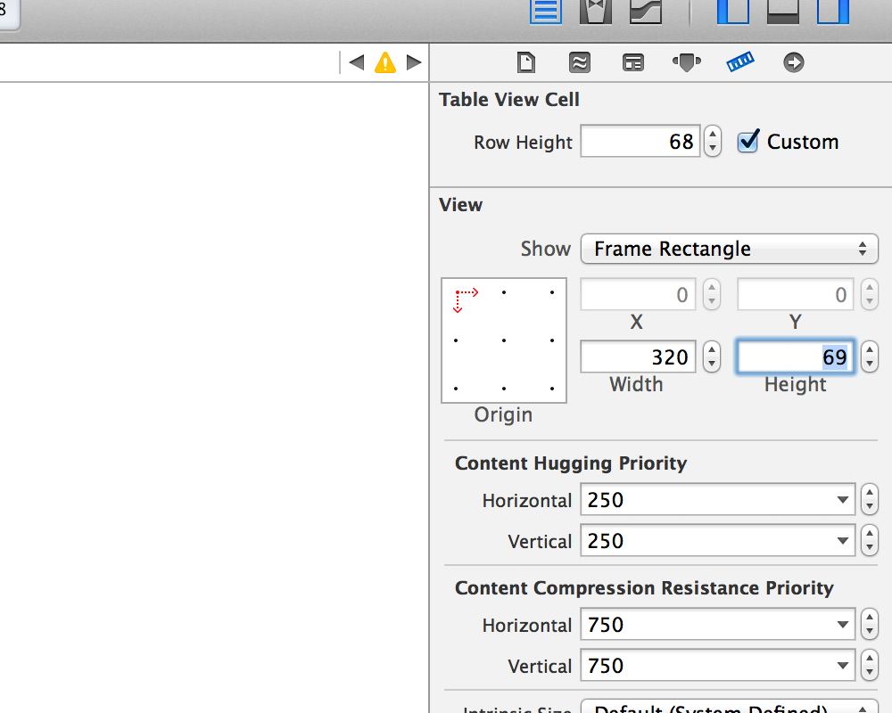
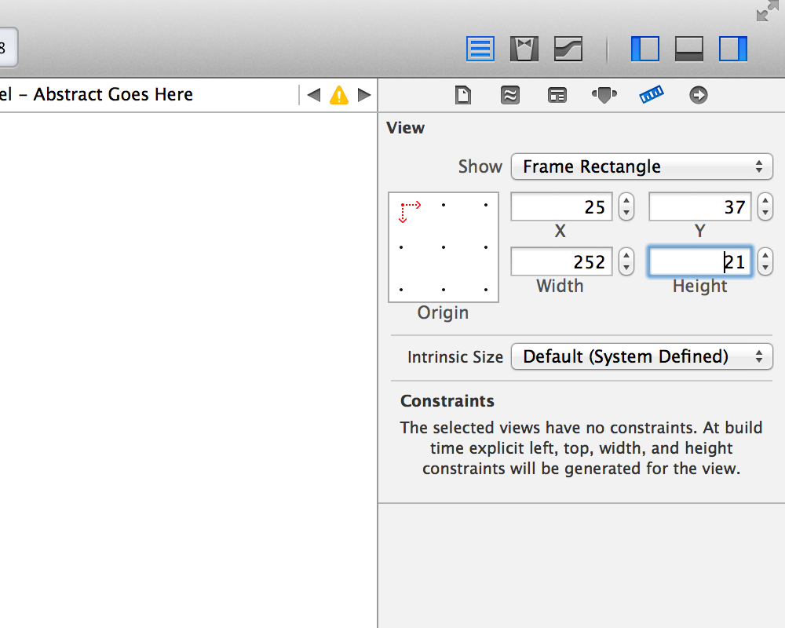
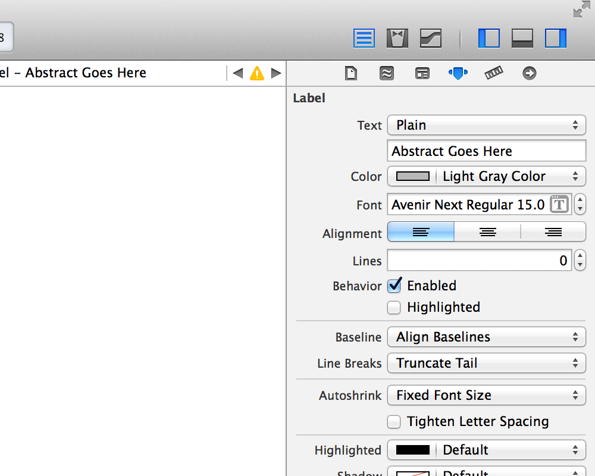
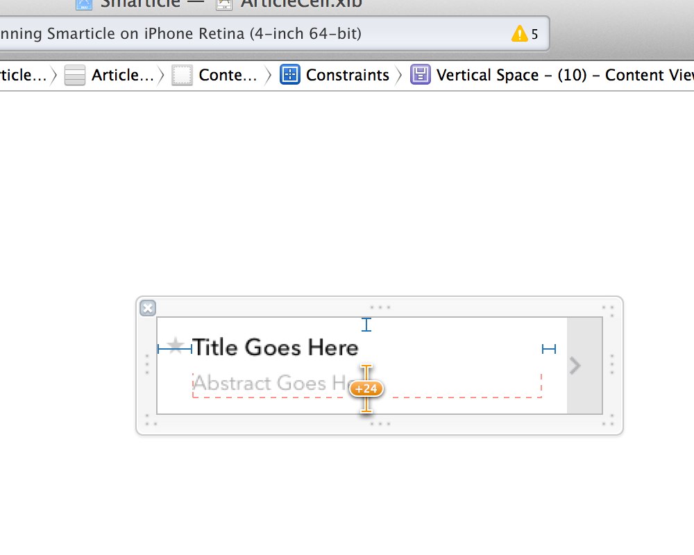
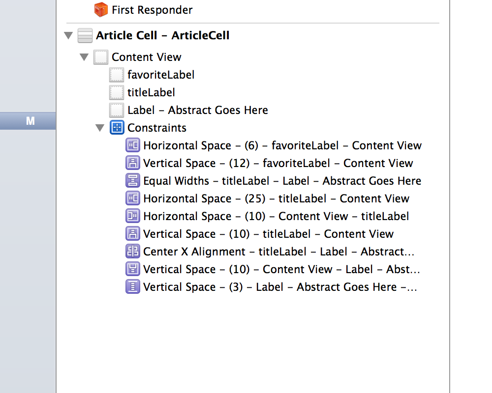

## Lab 4.1: Auto Layout

### Objectives

- Experiment with Auto Layout in Interface Builder
- Add the Article Abstract to `ListViewController`
- Practice Zen to Mitigate Auto Layout Frustrations

### Additional Resources ###

- [Introduction to Auto Layout](https://developer.apple.com/library/ios/documentation/userexperience/conceptual/AutolayoutPG/Introduction/Introduction.html)
- [Advanced Auto Layout Toolbox](http://www.objc.io/issue-3/advanced-auto-layout-toolbox.html)
- [Beginning Auto Layout Tutorial in iOS 7: Part 1](http://www.raywenderlich.com/50317/beginning-auto-layout-tutorial-in-ios-7-part-1)

### Development Setup

1. Clone the GitHub repository: `git@github.com:gosmartfactory/ios.git`
2. Browse to the following directory: `Week4/Source/SmarticleLab4.1`
3. Open the app in Xcode by double-clicking the project file: `Smarticle`
4. Run the app in the simulator by clicking on the Play icon or click on `Product -> Run`

### Update `ArticleCell`'s Height

1. Open `ArticleCell.xib`.
2. Select `Article Cell - ArticleCell` in the Document Outline view.
3. Open the Size Inspector window. (View > Utilities > Show Size Inspector)
4. Change the cell's height to 69.

### Add a UILabel for the Article's Abstract

1. Drag a UILabel control onto the content view under the title.
2. Hook up the UILabel to the `AbstractCell`'s `abstractLabel` outlet.
3. Edit the UILabel's properties to match the following values:
- X: 25
- Y: 37
- Width: 252
- Height: 21
- Color: Light Gray Color
- Font: Custom, Avenir Next, Regular, 15 point
- Lines: 0

### Remove the Obsolete Vertical Spacing Constraint

1. Expand the Constraints for `ArticleCell` in the Document Outline view.
2. Select `Vertical Space - (10) - Content View - titleLabel` and delete it.

### Add Other Constraints

1. Add a Vertical Space constraint from the title label to the abstract label. (The constant should have a default value of 3, which is what we want.)
2. Add a Center X constraint from the title label to the abstract label.
3. Add an equal widths constraint from the title label to the abstract label.
4. Add a Vertical Space constraint from the abstract label to the bottom of `contentView`. (The constant should be 10 this time.)

### Limit the Number of Abstract Lines

You can change the properties on `abstractLabel` to control how many lines are displayed before truncation. Try settings the number of visible lines to 1, 2, and 3, to see which you like best. My vote is for 3.

